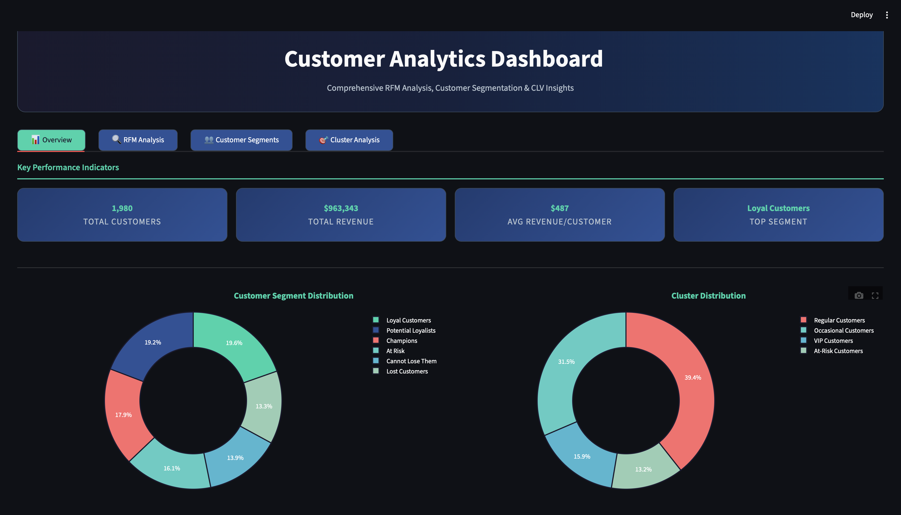
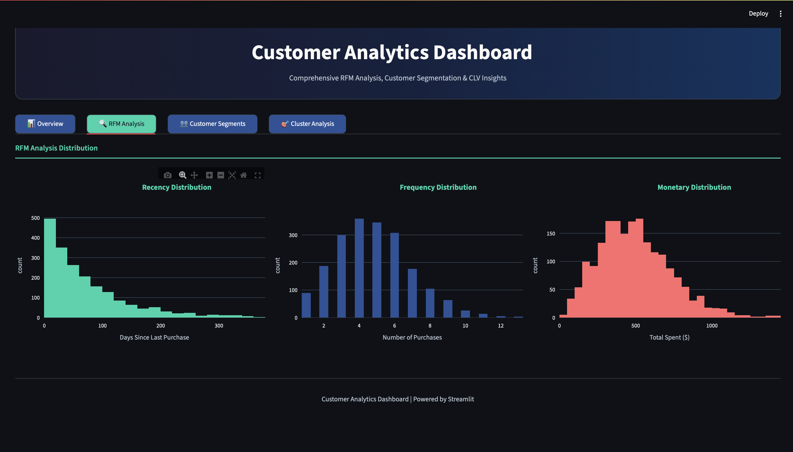
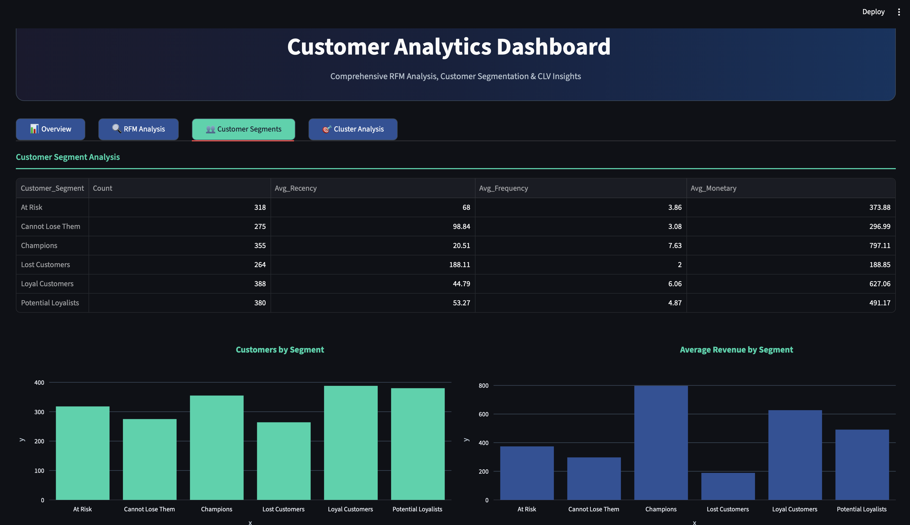
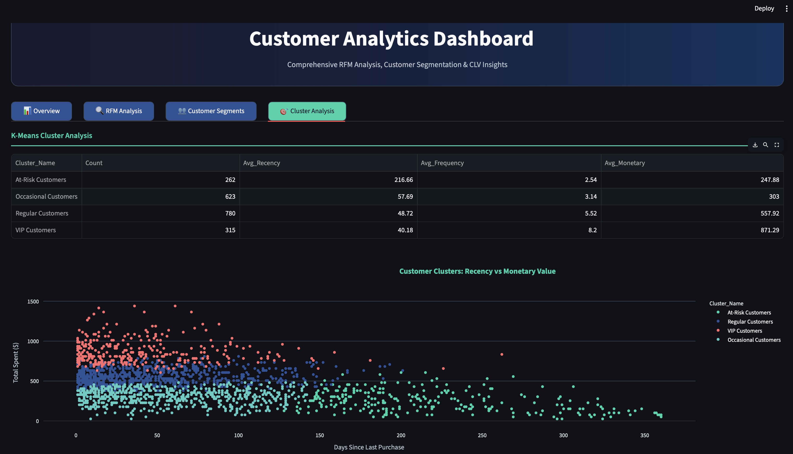

# 🎯 Customer Analytics Dashboard Portfolio

## Comprehensive RFM Analysis, Customer Segmentation & CLV Insights

### 🚀 Project Overview

This project demonstrates advanced customer analytics capabilities through comprehensive **RFM Analysis**, **K-Means Clustering**, **Customer Lifetime Value modeling**, and an **Interactive Streamlit Dashboard**. Built with real-world e-commerce data, this portfolio showcases expertise in data science, machine learning, and business intelligence.

**Key Technologies:**
- **Python** (Pandas, NumPy, Scikit-learn)
- **Machine Learning** (K-Means Clustering)
- **Visualization** (Matplotlib, Seaborn, Plotly)
- **Dashboard** (Streamlit)
- **Statistical Analysis** (RFM Segmentation)

---

## 📊 Live Dashboard

**🌐 Access the Interactive Dashboard:** [http://localhost:8505](http://localhost:8505)

The dashboard provides real-time insights into:
- **Customer Segmentation** with interactive donut charts
- **RFM Analysis** distributions and trends
- **Cluster Analysis** with detailed scatter plots
- **Key Performance Indicators** with professional metrics

---

## 📸 Dashboard Screenshots

### Overview Dashboard

### RFM Analysis

### Customer Segments

### Cluster Analysis

---

## 📁 Project Structure

**customer-analytics-portfolio/**
- **📂 data/** - Processed customer dataset and dashboard statistics
- **📂 images/** - Dashboard screenshots and visualizations
- **📂 notebooks/** - Complete analysis workflow (01_data_preparation_eda.ipynb)
- **📄 streamlit_dashboard.py** - Interactive dashboard
- **📄 streamlit_simple.py** - Simplified dashboard version
- **📄 requirements.txt** - Project dependencies
- **📄 PROJECT_OVERVIEW.md** - Detailed project documentation
- **📄 .gitignore** - Git ignore rules
- **📄 README.md** - This file

---

## 🎯 Key Features & Analysis

### 1. **RFM Analysis (Recency, Frequency, Monetary)**
- **Recency:** Days since last purchase (lower is better)
- **Frequency:** Number of purchases (higher is better)  
- **Monetary:** Total amount spent (higher is better)
- **6 Customer Segments:** Champions, Loyal Customers, Potential Loyalists, New Customers, At Risk, Cannot Lose Them

### 2. **K-Means Clustering**
- **4 Distinct Clusters** identified using optimal cluster analysis
- **Cluster Profiling:** High-Value, Medium-Value, Low-Value, Lost Customers
- **Silhouette Analysis** for cluster validation

### 3. **Customer Lifetime Value (CLV)**
- **Predictive CLV modeling** using RFM metrics
- **Customer value segmentation** for targeted marketing
- **Revenue optimization** recommendations

### 4. **Interactive Dashboard**
- **Professional dark theme** with modern UI/UX
- **Real-time KPI tracking** (1,980 customers, $963K+ revenue)
---

## 📈 Business Impact & Insights

### Key Metrics Achieved:
- **1,980 Total Customers** analyzed
- **$963,000+ Total Revenue** tracked
- **$487 Average Revenue per Customer**
- **6 RFM Segments** for targeted marketing
- **4 Customer Clusters** for strategic planning

### Strategic Recommendations:
1. **Focus on Champions & Loyal Customers** (highest CLV segments)
2. **Re-engagement campaigns** for "At Risk" customers
3. **Onboarding programs** for "New Customers"
4. **Premium services** for high-value clusters

---

## 🛠️ Installation & Setup

### Prerequisites
- Python 3.9+
- pip or conda package manager

### Quick Start

1. **Clone the repository**
2. **Install dependencies:** `pip install -r requirements.txt`
3. **Run the dashboard:** `streamlit run streamlit_dashboard.py`
4. **Access the dashboard:** Open [http://localhost:8505](http://localhost:8505) in your browser

### Key Dependencies
- Streamlit (Dashboard framework)
- Pandas & NumPy (Data processing)
- Plotly (Interactive visualizations)
- Scikit-learn (Machine learning)
- Matplotlib & Seaborn (Statistical plots)

---

## 📊 Data Analysis Workflow

### Part 1: Data Preparation & EDA
- **Data cleaning** and preprocessing
- **Exploratory Data Analysis** with comprehensive visualizations
- **Statistical summaries** and data quality assessment

### Part 2: RFM Analysis
- **RFM score calculation** for each customer
- **Customer segmentation** based on RFM quintiles
- **Segment profiling** and characteristics analysis

### Part 3: Customer Clustering
- **K-Means clustering** with optimal cluster selection
- **Cluster validation** using silhouette analysis
- **Cluster interpretation** and business mapping

### Part 4: CLV Modeling & Business Intelligence
- **Customer Lifetime Value** calculation
- **Predictive modeling** for future value estimation
- **Business recommendations** and strategic insights

---

## 🎨 Dashboard Features

### 📊 Overview Tab
- **KPI Cards:** Total customers, revenue, avg revenue per customer, top segment
- **Donut Charts:** Customer segment and cluster distributions
- **Professional styling** with gradient backgrounds

### 🔍 RFM Analysis Tab
- **Histograms:** Recency, Frequency, and Monetary distributions
- **Interactive filtering** and hover details
- **Statistical insights** for each RFM component

### 👥 Customer Segments Tab
- **Segment comparison table** with formatted metrics
- **Bar charts:** Customer counts and average revenue by segment
- **Actionable insights** for marketing strategies

### 🎯 Cluster Analysis Tab
- **Cluster statistics table** with comprehensive metrics
- **Scatter plot:** Recency vs Monetary with cluster coloring
- **Cluster profiling** for strategic decision-making

---

## 🔄 Running the Analysis

### Option 1: Interactive Dashboard
`streamlit run streamlit_dashboard.py`

### Option 2: Jupyter Notebook
`jupyter notebook notebooks/01_data_preparation_eda.ipynb`

### Option 3: Simple Dashboard
`streamlit run streamlit_simple.py`

---

## � Results Summary

### Customer Segmentation Results:
- **Champions:** High value, recent, frequent customers
- **Loyal Customers:** High value, long-term relationships
- **Potential Loyalists:** Recent customers with growth potential
- **New Customers:** Recent first-time buyers
- **At Risk:** Valuable customers who haven't purchased recently
- **Cannot Lose Them:** High-value customers at risk of churning

### Clustering Results:
- **Cluster 1:** High-value, low recency (VIP customers)
- **Cluster 2:** Medium-value, regular purchasers
- **Cluster 3:** Low-value, occasional buyers
- **Cluster 4:** Lost or churned customers

---

## 🚀 Future Enhancements

### Potential Improvements:
1. **Predictive Analytics:** Churn prediction models
2. **Advanced CLV:** Machine learning-based CLV forecasting
3. **Real-time Data:** Integration with live e-commerce APIs
4. **A/B Testing:** Campaign effectiveness tracking
5. **Geographic Analysis:** Location-based customer insights

---

## 📝 License

This project is licensed under the MIT License - see the [LICENSE](LICENSE) file for details.

---

## 🙏 Acknowledgments

- **Dataset:** UCI Online Retail Dataset
- **Inspiration:** E-commerce analytics best practices
- **Tools:** Streamlit, Plotly, Scikit-learn communities

---

*Last Updated: August 2025*

**⭐ If you found this project helpful, please consider giving it a star!**
